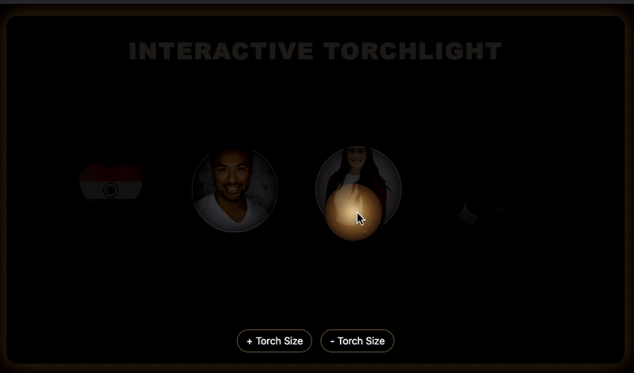
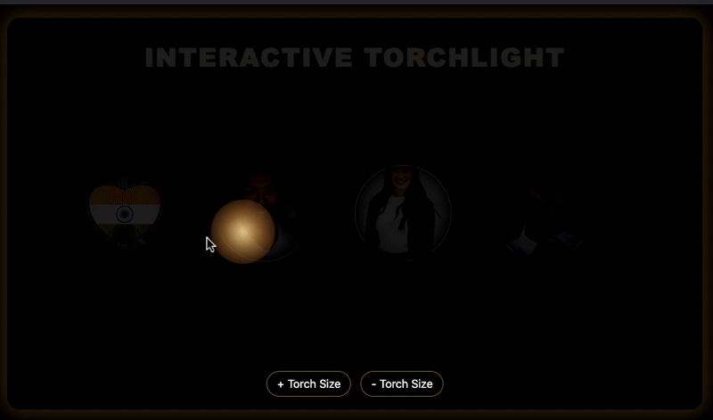

# 🔦 Interactive Torchlight Effect (Horizontal)

This is a visually engaging **Interactive Torchlight Effect** built using **HTML, CSS, and JavaScript**. Move your mouse (or finger on mobile) to simulate a torchlight that reveals hidden elements in a dark environment. Ideal for learning about mouse tracking, dynamic styling, and DOM interactions.

---

## 🌟 Features

- Real-time torchlight movement using mouse or touch input
- Smooth transition and glow effects
- Brightness control on nearby elements (e.g., faces or images)
- Responsive and performance-optimized
- Horizontal layout with interactive image reveal

---

## 📸 Preview

  
  
> Hover or touch to explore the hidden faces with a glowing torch effect.

---

## 🚀 How It Works

- A circular gradient simulates the torchlight.
- JavaScript tracks the cursor/touch position and updates the torch element.
- The distance from torch to each target (face) is calculated and used to dynamically change:
  - Brightness
  - Border glow
  - Scaling (for subtle pop effect)

---

## 🛠️ Technologies Used

- HTML5
- CSS3 (custom gradients, blend modes, shadows)
- Vanilla JavaScript (DOM manipulation, animation)

---

📁 Folder Structure
<pre> interactive-torchlight-effect/ ├── 4a.jpg ├── 4b.jpg ├── 4c.jpg ├── indian_flag.png ├── index.html ├── image.png ├── torchlight.gif └── README.md </pre>

    ⚠️ Ensure all images (.jpg, .png, .gif) are in the same folder.

---

## 📱 Responsive?

- 🖥️ Mouse tracking: Works best on desktops/laptops  
- 📱 Touch support: Works smoothly on phones/tablets too

---

## 🎯 Learning Outcomes

- Creating dynamic lighting effects with CSS + JS
- Handling mouse & touch events
- Mapping distance to style (brightness, scale, opacity)
- Visual feedback and interactivity principles

---

## 📌 To Run Locally

```bash
# From the root of the WebMiniApps repo:
cd interactive-torchlight-effect
open index.html  # or right-click > "Open with Live Server" in VS Code
🧠 Inspired By

Torchlight reveal animations commonly used in:

    Game UIs

    Secret content reveals

    Interactive educational sites

👨‍💻 Made with ❤️ by CodeWithHps

